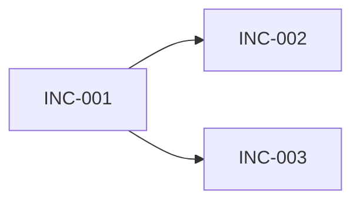

# План поставки

## Стратегия поставки

{{HOW_THE_FEATURE_IS_SLICED_AND_WHY}}

## Обзор зависимостей

## Инкремент INC-001: {{NAME}}

### Наблюдаемый результат

{{USER_OR_SYSTEM_VISIBLE_CAPABILITY}}

### Требования

- {{REQ_ID}}

### Scope

- Компоненты: {{COMPONENTS}}
- Контракты: {{CONTRACTS}}
- Изменения данных: {{CHANGES_OR_NONE}}
- Безопасность/наблюдаемость: {{CHANGES_OR_NONE}}

### Зависимости

- {{INC_ID_EXTERNAL_DECISION_OR_NONE}}

### Критерии приёмки

1. {{TESTABLE_CRITERION}}
2. {{TESTABLE_CRITERION}}

### Проверка

- {{VER_ID_OR_LINK}}

### Rollout и rollback

- Включение: {{METHOD}}
- Сигнал успеха: {{METRIC}}
- Rollback: {{METHOD}}

### Владелец и статус

- Владелец: {{OWNER}}
- Статус: {{PLANNED|READY|IN_PROGRESS|DONE|BLOCKED}}

## Межинкрементные зависимости

| Откуда | Куда | Зависимость | Риск/mitigation |
|---|---|---|---|
| {{INC_ID}} | {{INC_ID}} | {{DEPENDENCY}} | {{MITIGATION}} |

## Отложенная работа

| ID | Элемент | Причина | Владелец | Условие возврата |
|---|---|---|---|---|
| {{ID}} | {{ITEM}} | {{REASON}} | {{OWNER}} | {{TRIGGER}} |

## Готовность плана

Этот план описывает будущую реализацию и не является командой её начать.

- [ ] Каждый инкремент даёт наблюдаемое поведение или проверяемую capability.
- [ ] Нет задач, разбитых только по техническим слоям без end-to-end результата.
- [ ] Все `MUST` назначены инкрементам.
- [ ] Зависимости, владельцы и acceptance criteria определены.
- [ ] Каждый выпускаемый инкремент имеет проверку и rollback/disable path.
