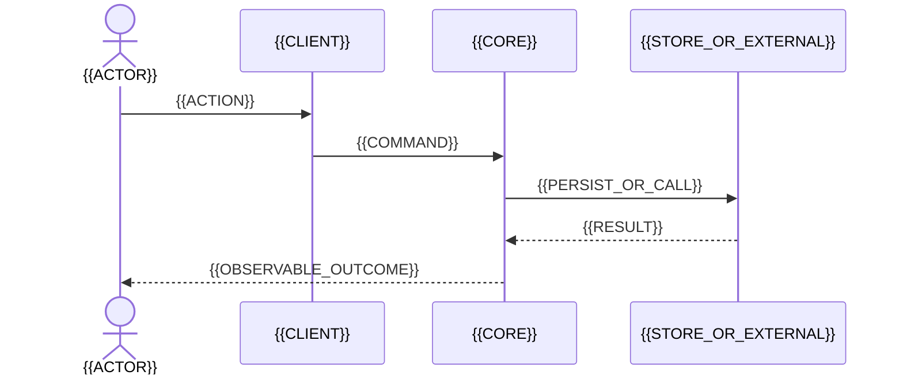

# Целевая архитектура

- Цели / scope / non-goals: {{BR_QA_IDS_AND_CHARTER_LINK}}
- Ключевой механизм и границы: {{END_TO_END_SUMMARY}}

```mermaid
%% ac_id: target-container
%% ac_state: target
%% ac_purpose: обзор целевой архитектуры {{FEATURE_NAME}}
%% ac_scope: {{SCOPE}}
%% ac_legend: стрелка — обязательная связь
%% ac_revision: {{REVISION}}
%% ac_normative: target-architecture.md
flowchart LR
    User[{{ACTOR}}] --> Client[{{CLIENT}}] --> Core[{{CORE}}] --> Store[({{SYSTEM_OF_RECORD}})]
    Core --> External[{{EXTERNAL_OR_OPTIONAL}}]
```

## Ключевой сценарий {{SCN_ID}}



## Компоненты и контракты

| Компонент/контракт | Ответственность и семантика | Владеет / граница | Совместимость | Требования |
|---|---|---|---|---|
| {{ITEM}} | {{RESPONSIBILITY}} | {{OWNERSHIP}} | {{RULE}} | {{REQ_IDS}} |

## Модель данных

Опиши только затронутые данные. Если модель не меняется, зафиксируй это и дай
ссылку на актуальное описание текущей системы.

| Сущность / объект-значение / сообщение | Назначение и владелец | Существенные поля, типы и обязательность | Ключи, связи и кардинальность | Инварианты, состояния и жизненный цикл | Требования |
|---|---|---|---|---|---|
| {{DATA_ITEM}} | {{PURPOSE_AND_OWNER}} | {{FIELDS_TYPES_OPTIONALITY}} | {{KEYS_RELATIONS_CARDINALITY}} | {{INVARIANTS_STATES_RETENTION_EVOLUTION}} | {{REQ_IDS}} |

```mermaid
%% ac_id: data-model
%% ac_state: target
%% ac_purpose: показать затронутые сущности данных и их связи
%% ac_scope: {{DATA_MODEL_SCOPE}}
%% ac_legend: связь показывает кардинальность целевой модели
%% ac_revision: {{REVISION}}
%% ac_normative: target-architecture.md
erDiagram
    {{ENTITY_A}} ||--o{ {{ENTITY_B}} : "{{RELATION}}"
```

Для DTO, сообщений, объектов-значений или моделей документов замени `erDiagram`
на `classDiagram`. Если модель данных не меняется, удали схему и таблицу,
зафиксируй отсутствие изменений и дай ссылку на актуальную текущую модель.

## Данные, безопасность и надёжность

| Область | Решение / инвариант | Failure и recovery | Проверка / сигнал |
|---|---|---|---|
| Данные и консистентность | {{SOR_TRANSACTIONS_IDEMPOTENCY_RETENTION}} | {{FAILURE_RECOVERY}} | {{VER_OR_SIG}} |
| Security/privacy | {{TRUST_AUTH_SENSITIVE_DATA_ABUSE}} | {{FAILURE_RECOVERY}} | {{VER_OR_SIG}} |
| Performance/reliability | {{BUDGET_AND_MECHANISM}} | {{FAILURE_RECOVERY}} | {{VER_OR_SIG}} |
| Operations | {{DEPLOYMENT_LOGS_METRICS_RUNBOOK}} | {{FAILURE_RECOVERY}} | {{VER_OR_SIG}} |

## Реализация и evidence

- Изменения / reuse / новые зависимости: {{BOUNDED_CHANGES_AND_JUSTIFICATION}}
- Переход, rollout и rollback: [delivery-plan.md](delivery-plan.md)
- Риски и допущения: [requirements.md](requirements.md)
- ADR только для самостоятельных решений: {{ADR_LINKS_OR_NONE}}
- No-go evidence и влияние на maturity: {{EVIDENCE_STATUS_AND_LINKS}}
