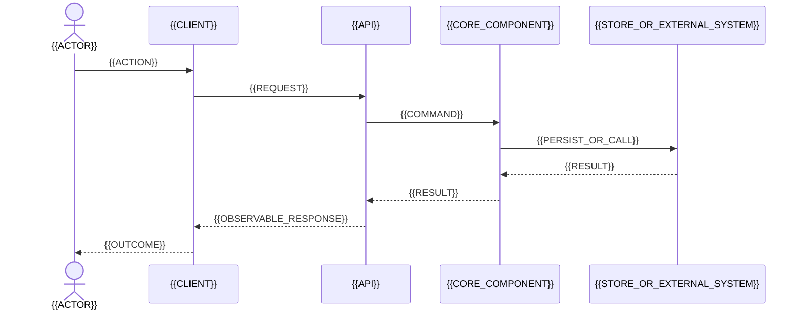

# Целевая архитектура

## Scope и цели

- Бизнес-цели: {{BR_IDS}}
- Включённый scope: {{SUMMARY_OR_LINK}}
- Исключённый scope: {{SUMMARY_OR_LINK}}
- Драйверы качества: {{QA_IDS}}

## Архитектура в одном взгляде

```mermaid
%% ac_id: target-container
%% ac_state: target
%% ac_purpose: обзор целевой архитектуры {{FEATURE_NAME}}
%% ac_scope: {{SCOPE}}
%% ac_legend: сплошная стрелка — синхронная или обязательная связь
%% ac_revision: {{REVISION}}
%% ac_normative: target-architecture.md
flowchart LR
    User[{{ACTOR}}]
    UI[{{UI_OR_CLIENT}}]
    API[{{API_COMPONENT}}]
    Worker[{{WORKER_OR_SERVICE}}]
    DB[({{SYSTEM_OF_RECORD}})]
    External[{{EXTERNAL_SYSTEM_OR_STORAGE}}]

    User --> UI
    UI --> API
    API --> DB
    Worker --> DB
    Worker --> External
```

## Ключевые end-to-end сценарии

### {{SCN_ID}}: {{NAME}}



1. {{STEP}}
2. {{STEP}}
3. {{OUTCOME}}

## Компоненты и ответственность

| Компонент | Ответственность | Владеет | Не должен владеть | Требования |
|---|---|---|---|---|
| {{COMPONENT}} | {{RESPONSIBILITY}} | {{DATA_CAPABILITY}} | {{BOUNDARY}} | {{REQ_IDS}} |

## Контракты

| Контракт | Производитель | Потребитель | Семантика | Совместимость | Требования |
|---|---|---|---|---|---|
| {{API_EVENT_JOB}} | {{PRODUCER}} | {{CONSUMER}} | {{SEMANTICS}} | {{RULE}} | {{REQ_IDS}} |

## Доменная модель и состояния

- Сущности/value objects: {{DESCRIPTION_OR_LINK}}
- Инварианты: {{INV_IDS}}
- State machine: {{LINK_OR_NOT_APPLICABLE}}
- Границы владения: {{DESCRIPTION}}

## Данные и консистентность

- System of record: {{DESCRIPTION}}
- Транзакционные границы: {{DESCRIPTION}}
- Модель консистентности: {{DESCRIPTION}}
- Идемпотентность/deduplication: {{DESCRIPTION}}
- Retention/deletion: {{DESCRIPTION}}
- Миграция данных: [Evolution Plan](evolution-plan.md)

## Безопасность и приватность

- Trust boundaries: {{DESCRIPTION_OR_DIAGRAM}}
- Аутентификация: {{DESCRIPTION}}
- Авторизация: {{DESCRIPTION}}
- Чувствительные данные: {{DESCRIPTION}}
- Защита от abuse: {{DESCRIPTION}}
- Аудит: {{DESCRIPTION}}
- Связанные требования/reviews: {{LINKS}}

## Производительность и надёжность

| Budget | Цель | Механизм | Evidence | Эксплуатационный сигнал |
|---|---|---|---|---|
| {{QA_ID}} | {{TARGET}} | {{DESIGN_MECHANISM}} | {{BENCHMARK_OR_ANALYSIS}} | {{METRIC}} |

### Failure modes

| Отказ | Ожидаемое поведение | Восстановление | Влияние на пользователя | Проверка |
|---|---|---|---|---|
| {{FAILURE}} | {{BEHAVIOR}} | {{RECOVERY}} | {{IMPACT}} | {{VER_ID}} |

## Эксплуатация и наблюдаемость

- Топология deployment: {{DESCRIPTION_OR_DIAGRAM}}
- Логи: {{REQUIRED_EVENTS_AND_FIELDS}}
- Метрики: {{METRICS}}
- Трассировка/correlation: {{DESCRIPTION}}
- Alerts: {{CONDITIONS}}
- Runbooks/ручное восстановление: {{LINKS_OR_PLAN}}

## Границы реализации

- Требуемые изменения: {{SUMMARY}}
- Переиспользуемые паттерны: {{PATTERNS}}
- Новые зависимости/инфраструктура: {{ITEMS_AND_JUSTIFICATION}}
- Явные non-goals: {{ITEMS}}

## Ключевые решения

| Решение | ADR | Статус |
|---|---|---|
| {{DECISION}} | {{ADR_LINK}} | {{STATUS}} |

## Предположения, риски и открытые вопросы

См. [Risks and Assumptions](risks-and-assumptions.md).

## Feasibility evidence

| Evidence ID | No-go | Статус | Результат/ссылка | Последствие для дизайна |
|---|---|---|---|---|
| {{EVIDENCE_ID}} | {{yes/no}} | {{PLANNED|AUTHORIZED|COMPLETE|INCONCLUSIVE}} | {{LINK}} | {{IMPACT}} |

Пока no-go evidence не выполнен, maturity не выше `DESIGN_CANDIDATE`.

## История ревизий

| Ревизия | Дата | Trigger/findings | Изменения | Автор |
|---|---|---|---|---|
| {{REV}} | {{DATE}} | {{FINDING_IDS}} | {{SUMMARY}} | {{OWNER}} |

## Состояния (при необходимости)

```mermaid
%% ac_id: target-state
%% ac_state: target
%% ac_purpose: жизненный цикл {{ENTITY}}
%% ac_scope: {{SCOPE}}
%% ac_legend: стрелка — допустимый переход, подпись — событие
%% ac_revision: {{REVISION}}
%% ac_normative: target-architecture.md
stateDiagram-v2
    [*] --> {{INITIAL_STATE}}
    {{INITIAL_STATE}} --> {{ACTIVE_STATE}}: {{EVENT}}
    {{ACTIVE_STATE}} --> {{SUCCESS_STATE}}: {{EVENT}}
    {{ACTIVE_STATE}} --> {{FAILURE_STATE}}: {{EVENT}}
    {{FAILURE_STATE}} --> {{ACTIVE_STATE}}: {{RETRY_EVENT}}
    {{SUCCESS_STATE}} --> [*]
```
